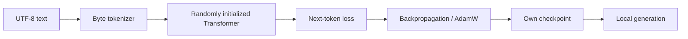

# WUPS LLM From Scratch

A small, reproducible language-model prototype trained **from random initialization**. The repository demonstrates the full path from raw UTF-8 text to an original checkpoint and local text generation.

> **No third-party pretrained model weights are loaded.** PyTorch is used as the tensor/autograd framework; the model parameters themselves are initialized randomly and learned by this project.

## Why this repository exists

This is an engineering proof-of-concept for a future WUPS AI engine. It is deliberately small enough to train on an ordinary laptop before scaling the same ideas to larger datasets and GPU infrastructure.

The prototype includes:

- a self-contained UTF-8 byte tokenizer (`tokenizer.py`);
- a decoder-only causal Transformer (`model.py`);
- random weight initialization;
- an end-to-end pretraining script (`train.py`);
- checkpoint metadata and dataset SHA-256;
- local inference / sampling (`generate.py`);
- smoke tests;
- a small self-authored Russian / Kazakh / English training corpus.

## What “own weights” means here

At startup the network parameters are random. `train.py` optimizes those parameters only on the corpus passed with `--data`, then writes the learned tensors to a new `.pt` checkpoint. There is no code path that downloads or loads Llama, Qwen, GPT, Gemma or another pretrained checkpoint.

This is **not** a claim that a tiny laptop model competes with large commercial LLMs. The goal is to make the training chain transparent and reproducible before scaling it.

## Verified demo

The published prototype has been executed end-to-end on CPU:

- **119,424 parameters** in the verification model;
- **400 training steps** from random initialization;
- training loss: **5.5647 → 2.1650**;
- validation loss: **2.2749**;
- checkpoint SHA-256: `4b31f8d1725602cc0bc9de47afd9694b43a34b8dc817dccb5a364eb9485fa6d5`.

See [`VERIFICATION.md`](VERIFICATION.md) and [`artifacts/demo_checkpoint_metadata.json`](artifacts/demo_checkpoint_metadata.json).

## Architecture

Default configuration:

- tokenizer: direct UTF-8 bytes, vocabulary = 256;
- context length: 128 tokens;
- hidden size: 128;
- layers: 4;
- attention heads: 4;
- decoder-only causal self-attention;
- GELU MLP;
- tied input/output embeddings.

All defaults can be changed from the command line.

## Data flow



## Quick start

Python 3.10+ is recommended.

```bash
python -m venv .venv
# Windows: .venv\Scripts\activate
# Linux/macOS: source .venv/bin/activate
pip install -r requirements.txt
pytest -q
python train.py --steps 300
python generate.py --prompt "AI " --tokens 120
```

For a very quick CPU smoke run:

```bash
python train.py --steps 10 --batch-size 4 --block-size 64 --d-model 64 --n-layers 2 --n-heads 4 --out checkpoints/smoke.pt
python generate.py --checkpoint checkpoints/smoke.pt --prompt "WUPS " --tokens 40
```

## Checkpoint contents

A checkpoint stores:

- `model_state_dict` — learned tensors;
- `model_config` — architecture used for the run;
- tokenizer metadata;
- step count and losses;
- training seed;
- SHA-256 of the exact dataset used for training.

Generated binary checkpoints are ignored by Git by default so the repository stays lightweight. The training command recreates them locally.

## Roadmap

1. Replace the fixed byte tokenizer with a trainable tokenizer and version its vocabulary.
2. Build dataset ingestion, deduplication and quality filters.
3. Add mixed precision, gradient accumulation and resumable checkpoints.
4. Add evaluation suites for Russian, Kazakh and English.
5. Scale parameter count and corpus size on rented GPUs.
6. Build an inference service and agent/tool layer around the model.

## Verification

See [`VERIFICATION.md`](VERIFICATION.md) for the actual smoke-test run performed before publication.

## Status

Early technical prototype / research engineering experiment.
